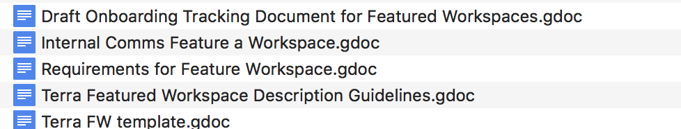
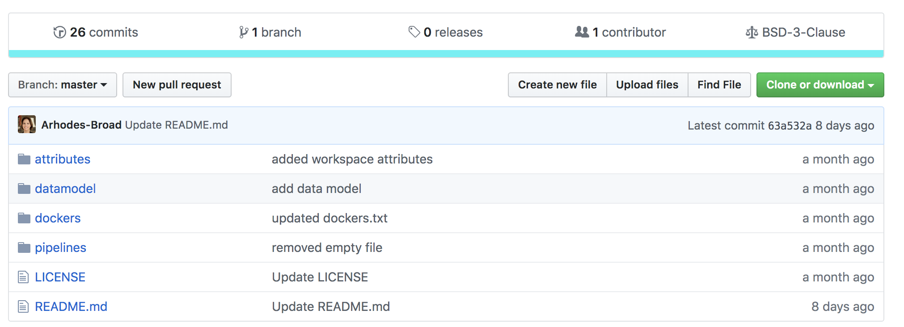
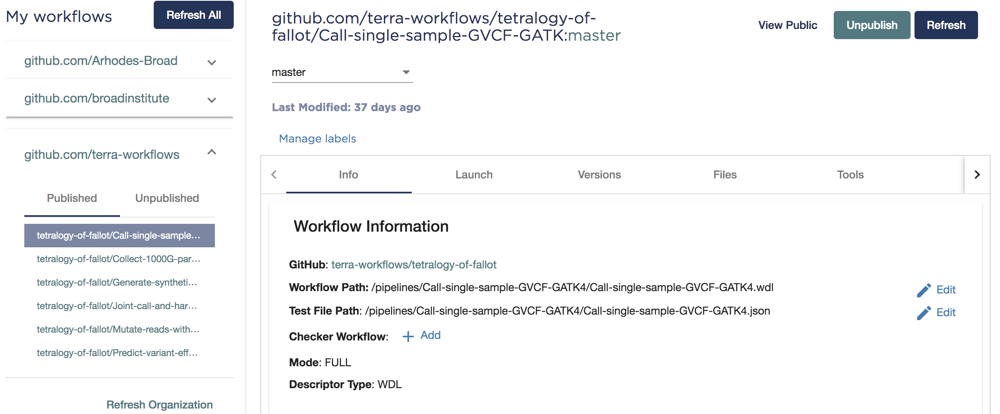

This document consolidates the expectations from the several files that are currently in the google drive.

## Dashboard

* [ ] Title  
* [ ] Overview Paragraph 
* [ ] Experimental Design (required for analysis-focused workspaces) 
* [ ] Data
      * [ ] Sample Data
      * [ ] Workspace Data
* [ ] Tools
* [ ] Tool Name Versions 
* [ ] Notebooks 
* [ ] Software versions
* [ ] Time and cost
* [ ] Contact Information
* [ ] Licensing

[Example Dashboard](Example_Dashboard.png)
[Template Document](Terra_FW_Template.pdf)

## WDL

* [ ] WDL is in a repository
     - [ ] Scientist has uploaded to Methods Repo
      - [ ] Scientist has uploaded wdl and json to Github 
            - [ ] and made a workflow in Dockstore
      - [ ] Comms Team member has uploaded the wdl and json to  [terra-workflows github](https://github.com/terra-workflows/)
      - [ ] & made a workflow in Dockstore.
      
[Example Github Structure in terra-workflows](https://github.com/terra-workflows/tetralogy-of-fallot)

      
[Example Workflow on Dockstore](https://dockstore.org/my-workflows/github.com/terra-workflows/tetralogy-of-fallot/Call-single-sample-GVCF-GATK)

      
            
If repo isn’t available, send the wdl and json directly to CD.
Upload or Send a ReadMe describing the contents of the repo (ask CD for template).

* [ ] Scientist has uploaded to Dockstore
* [ ] unchecked 
* [ ] unchecked 
* [ ] unchecked 
* [ ] unchecked 

## Notebook

* [ ] unchecked 
* [ ] unchecked 
* [ ] unchecked 
* [ ] unchecked 
* [ ] unchecked 
* [ ] unchecked 

## Dataset 

* [ ] unchecked 
* [ ] unchecked 
* [ ] unchecked 
* [ ] unchecked 
* [ ] unchecked 
* [ ] unchecked 

## Review

* [ ] unchecked 
* [ ] unchecked 
* [ ] unchecked 
* [ ] unchecked 
* [ ] unchecked 
* [ ] unchecked 

## Finishing Steps

* [ ] unchecked 
* [ ] unchecked 
* [ ] unchecked 
* [ ] unchecked 
* [ ] unchecked 
* [ ] unchecked 

